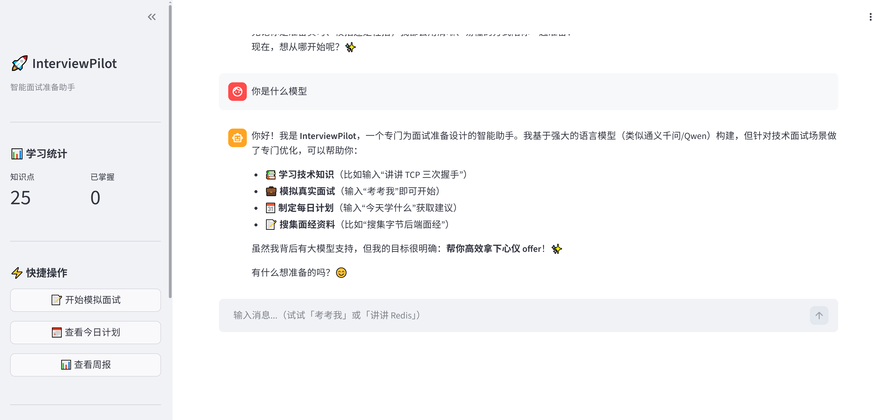
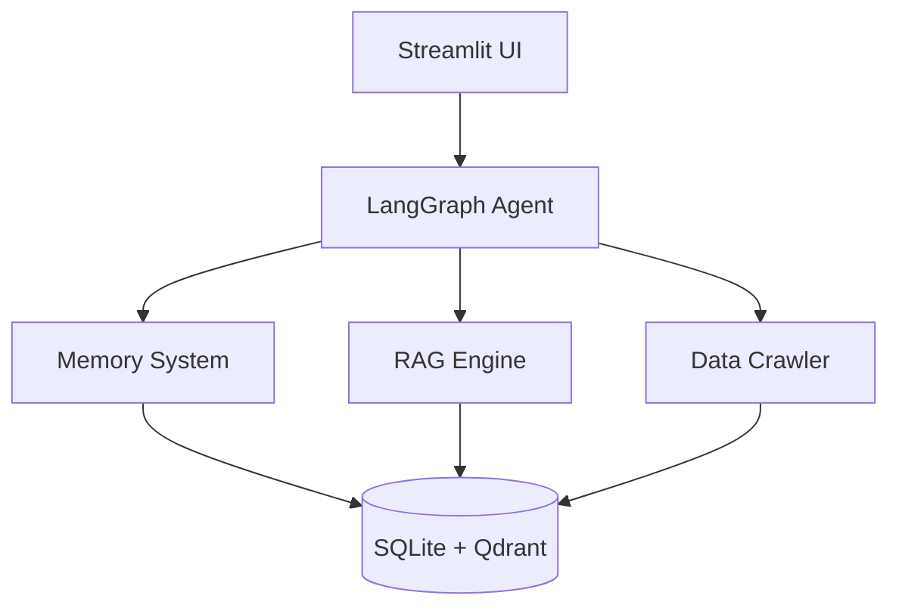
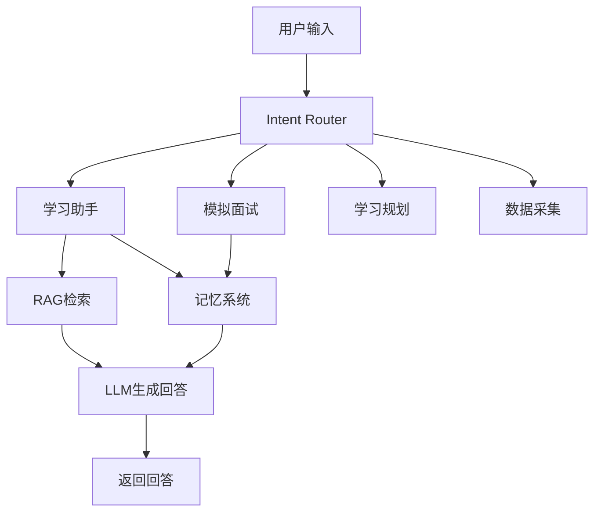

# 🚀 Interview Pilot


**Interview Pilot** 是一个基于 **Agent + RAG + 记忆系统** 的 AI 面试学习助手。

项目目标是构建一个完整的 **AI 面试学习闭环系统**：

```
学习 → 记忆 → 复习 → 模拟面试 → 反馈 → 再学习
```

该系统可以帮助开发者：

- 📚 学习技术知识
- 🧠 管理知识记忆
- 🎯 进行模拟面试
- 📊 生成学习规划
- 🌐 自动采集互联网面试经验

---

# 📸 Demo

//导入图片



---

# ✨ 核心功能

## 1️⃣ AI 学习助手

用户可以直接提问技术问题：

```
用户：什么是 Transformer？
```

系统流程：

```
用户问题
   ↓
Agent Router
   ↓
RAG 检索知识库
   ↓
结合用户历史记忆
   ↓
LLM生成讲解
```

特点：

- RAG 检索增强
- 个性化上下文
- 自动记录学习历史

---

## 2️⃣ 智能记忆系统

系统采用 **SM-2 遗忘曲线算法** 管理学习进度。

每个知识点记录：

- 熟练度
- 复习间隔
- 下次复习时间

示例：

| 知识点 | 熟练度 | 下次复习 |
|------|------|---------|
| Transformer | ⭐⭐⭐⭐ | 3天 |
| CNN | ⭐⭐ | 明天 |

系统每天自动生成：

```
今日复习任务
```

---

## 3️⃣ AI 模拟面试

系统会根据：

- 用户薄弱知识点
- 遗忘曲线
- 高频面试题

自动生成模拟面试。

示例：

```
面试官：请解释 BatchNorm 的作用？
```

回答后系统会：

- 自动评分
- 更新记忆状态
- 给出改进建议

---

## 4️⃣ 自动采集面试经验

系统支持自动采集互联网面试经验：

来源：

- 小红书
- 抖音
- LeetCode
- 面试经验帖

数据处理流程：

```
爬虫采集
   ↓
LLM清洗
   ↓
知识结构化
   ↓
向量化
   ↓
存入知识库
```

最终形成 **AI 面试知识库**。

---

# 🧠 系统架构



---

# 🔄 系统流程



---

# 📁 项目结构

```
interview-pilot/
│
├── config/                          # 配置中心
│   ├── settings.py
│   └── knowledge_schema.py
│
├── crawler/                         # 数据采集
│   ├── base_crawler.py
│   ├── xiaohongshu_crawler.py
│   ├── douyin_crawler.py
│   ├── leetcode_crawler.py
│   └── data_cleaner.py
│
├── storage/                         # 数据存储
│   ├── sqlite_store.py
│   ├── vector_store.py
│   └── models.py
│
├── memory/                          # 记忆系统
│   ├── mem0_client.py
│   ├── sm2_engine.py
│   └── memory_manager.py
│
├── rag/                             # RAG引擎
│   ├── chunker.py
│   ├── embedder.py
│   ├── retriever.py
│   ├── reranker.py
│   └── rag_pipeline.py
│
├── agent/                           # Agent工作流
│   ├── graph.py
│   ├── state.py
│   └── nodes/
│
├── ui/                              # 前端
│   └── app.py
│
├── data/                            # 本地数据
│
├── tests/                           # 单元测试
│
├── main.py                          # 程序入口
├── requirements.txt
├── docker-compose.yml
└── README.md
```

---

# 🛠 技术栈

## Agent

- LangGraph
- LangChain

## RAG

- Qdrant
- BM25
- Embedding Models

## Memory

- Mem0
- SM-2 遗忘曲线

## Backend

- Python
- SQLite
- Pydantic

## Frontend

- Streamlit

## Crawler

- Playwright
- HTTPX

---

# ⚙️ 安装

## 1️⃣ 克隆项目

```bash
git clone https://github.com/yourname/interview-pilot.git
cd interview-pilot
```

---

## 2️⃣ 安装依赖

```bash
pip install -r requirements.txt
```

---

## 3️⃣ 配置环境变量

复制配置文件：

```bash
cp .env.example .env
```

编辑 `.env`

```
OPENAI_API_KEY=your_api_key
EMBEDDING_MODEL=text-embedding-3-small
LLM_MODEL=gpt-4o-mini
```

---

## 4️⃣ 启动向量数据库

```bash
docker-compose up -d
```

---

# 🚀 运行项目

## Web 模式

```bash
python main.py
```

浏览器访问：

```
http://localhost:8501
```

---

## CLI 模式

```bash
python main.py --mode cli
```

---

# 🧪 运行测试

运行全部测试：

```bash
pytest tests/ -v
```

运行单个测试文件：

```bash
pytest tests/test_memory.py -v
```

运行指定测试：

```bash
pytest tests/test_memory.py::TestSM2Engine::test_first_review_score_5 -v
```

---

# 📊 测试覆盖率

安装：

```bash
pip install pytest-cov
```

运行：

```bash
pytest tests/ -v --cov=. --cov-report=html
```

报告位置：

```
htmlcov/index.html
```

---

# 🗺 Roadmap

未来计划：

- [ ] RAG Reranker
- [ ] 自动题目生成
- [ ] 面试评分模型
- [ ] 知识图谱
- [ ] 多用户系统
- [ ] 在线部署
- [ ] Agent 自主学习能力

---

# 🤝 贡献

欢迎贡献代码：

1. Fork 项目
2. 创建 Feature Branch
3. 提交 Pull Request

---

# 📄 License

MIT License

---

# ⭐ Star History

如果这个项目对你有帮助，请给一个 ⭐ Star！